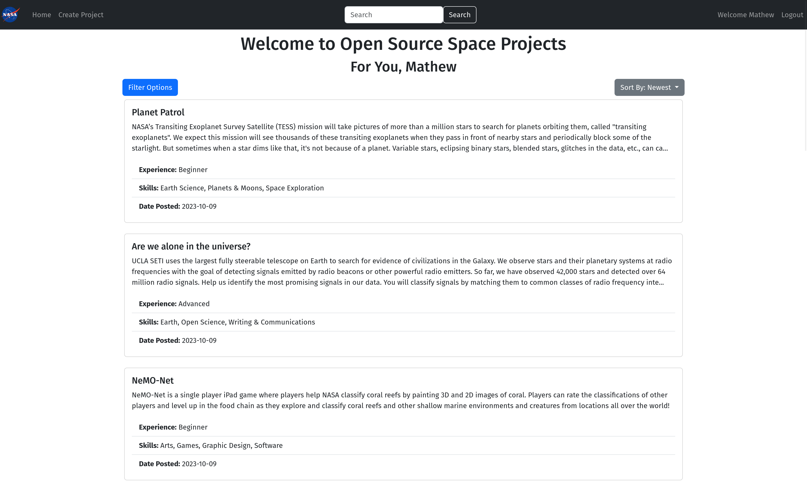
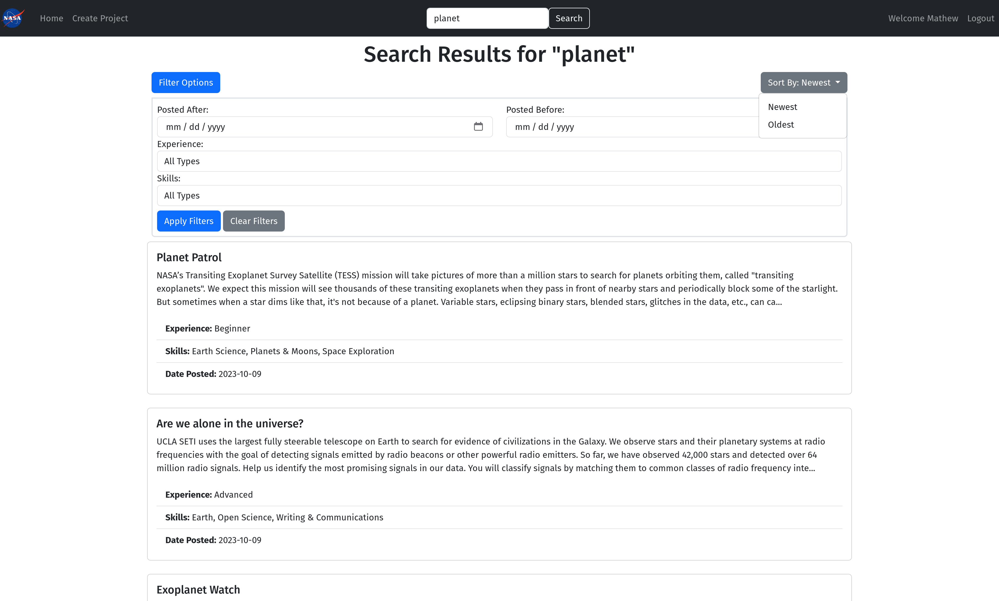
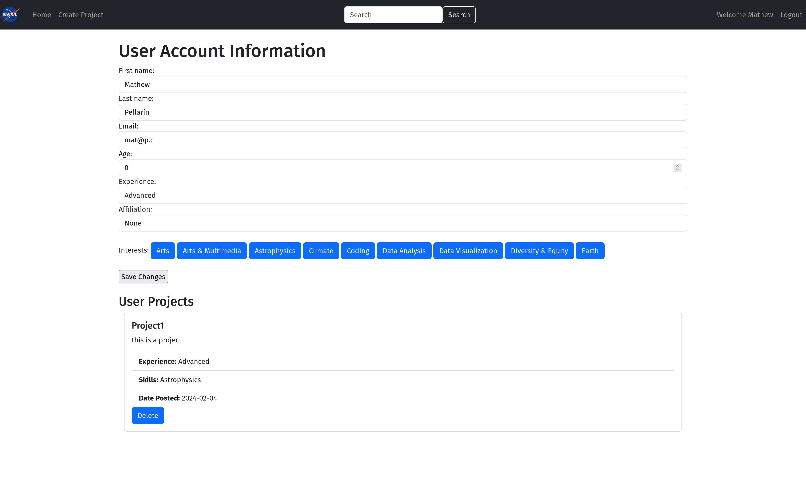

# A Marketplace for Open Science Projects
### Nasa Space Apps 2023

Our platform is a cutting-edge marketplace designed for open-source projects that empowers collaboration and innovation across the globe. As proud winners of the second place in our local division, we have developed a suite of features that streamline the process of finding, managing, and contributing to open-source projects. With functionalities such as advanced search capabilities, user project creation, and management, our platform stands out as a hub for open-source enthusiasts. Users can effortlessly communicate with others through integrated messaging, apply filters to refine their search, and much more, creating a comprehensive ecosystem for open science collaboration.

## Getting Started with the Platform
### Prerequisites

Before you start, make sure you have installed the necessary requirements which include Python, Flask, Docker, and other dependencies listed in our requirements.txt file.
Running the Application

Our platform can be run locally or in a containerized environment, offering flexibility and ease of use. Here's how to get it up and running:
Local Setup with Flask

1. Clone the repository to your local machine.
2. Open a terminal and type `cd NasaProject` to navigate to the project directory.
3. Install the dependencies with `pip install -r requirements.txt`.
4. Start the server using `flask.sh` or `flask.bat` depending on your operating system. This will set the necessary environment variables and start the Flask server.

Containerized Setup with Docker

1. Ensure Docker is installed and running on your system.
2. Build the Docker image using `docker build -t NasaProject .` from the root of the project directory.
3. Once the build is complete, run the container using `docker run -p 5000:5000 NasaProject`.
4. The platform should now be accessible at localhost:5000 on your browser.

### Accessing the Platform

After starting the server by either method, open your web browser and go to http://localhost:5000. You should be greeted with the homepage of our Open Projects Marketplace.

## Gallery
#### Homepage

#### Project Page

#### User Profile

---
# Project Description
## SUMMARY
There are many different open science and open-source projects and tools, but no efficient way to match project creators with interested collaborators who possess the skills required to contribute. Your challenge is to create a solution that will help people who are looking for open-source projects to work on and project creators who need skilled contributors to find each other and communicate.

## BACKGROUND
NASA is making a long-term commitment to build an inclusive open science community over the next decade. Open-source science is a commitment to openly sharing software, data, and knowledge (algorithms, papers, documents, ancillary information) as early as possible in the scientific process. It is also an opportunity to involve a wider range of people in research, including those from outside academia.

Open research initiatives can involve a variety of participants. Some open research projects involve participants who don’t possess specialized expertise, but other projects require contributors with specific skills. While it’s challenging for those who run open science projects to find people to participate, it’s also challenging for people who want to participate to find those projects. There are well-known, large, open-source software projects (e.g., Python, Linux) and well-known places to find open data (especially from NASA!), but currently, there is no place online for project creators and skilled participants to find each other, mingle, and foster professional relationships to work on interesting open research projects.

## OBJECTIVES
Your challenge is to create a tool that will enable open science project creators and skilled potential contributors to identify one another and communicate. Project creators will need to explain their projects and the type of collaborators (and level of expertise) they are looking for, together with the expected scope of work. Individuals looking to participate in open science projects will need to list the skills they can bring to a project and the types of projects they are seeking, and indicate when they are available to work. Think about how your tool will enable project creators to search for collaborators based on the skills and level of expertise they’re looking for. And how will individuals search for projects to work on based on their interests?

As a bonus: can your tool proactively suggest project creator-collaborator pairings based on the information each party has entered?

Once an individual and project creator are matched, how will your tool provide a means for them to communicate privately? Will your tool look something like the common job networking sites out there, or something entirely different? Be creative!

## POTENTIAL CONSIDERATIONS
You may (but are not required to) consider the following:

Remember that Space Apps judges cannot download executable files. The tool you develop will run in a web browser, requiring the web page and associated code to be hosted on a server. (See the Resources tab at the top of the page for suggested ways to search for information about free web hosting services.)
Research the repository that your team is using to ensure it offers web hosting. As an example, try searching for the repository name and “pages” or “web pages.” So if “foo” was the name of the repository, then try searching for “foo pages” or “foo web pages.”
Consider the desire for privacy from platform users; no personal information (names, e-mail addresses, etc.) should be publicly visible unless the user explicitly permits it.
Not everyone will want to create an online account to use your tool, so login credentials could be handled through third parties (e.g., Open Researcher and Contributor ID [ORCID], Google, LinkedIn, Facebook, etc.).

Tagging systems, skill lists, and other such ‘finite’ elements often become degraded over time or are too general to use effectively. How will your system make skillset matching flexible while avoiding these problems?

*For data and resources related to this challenge, refer to the Resources tab at the top of the page.*

## MIT License

Copyright (c) [2024] [Matp101]

Permission is hereby granted, free of charge, to any person obtaining a copy
of this software and associated documentation files (the "Software"), to deal
in the Software without restriction, including without limitation the rights
to use, copy, modify, merge, publish, distribute, sublicense, and/or sell
copies of the Software, and to permit persons to whom the Software is
furnished to do so, subject to the following conditions:

The above copyright notice and this permission notice shall be included in all
copies or substantial portions of the Software.

THE SOFTWARE IS PROVIDED "AS IS", WITHOUT WARRANTY OF ANY KIND, EXPRESS OR
IMPLIED, INCLUDING BUT NOT LIMITED TO THE WARRANTIES OF MERCHANTABILITY,
FITNESS FOR A PARTICULAR PURPOSE AND NONINFRINGEMENT. IN NO EVENT SHALL THE
AUTHORS OR COPYRIGHT HOLDERS BE LIABLE FOR ANY CLAIM, DAMAGES OR OTHER
LIABILITY, WHETHER IN AN ACTION OF CONTRACT, TORT OR OTHERWISE, ARISING FROM,
OUT OF OR IN CONNECTION WITH THE SOFTWARE OR THE USE OR OTHER DEALINGS IN THE
SOFTWARE.
